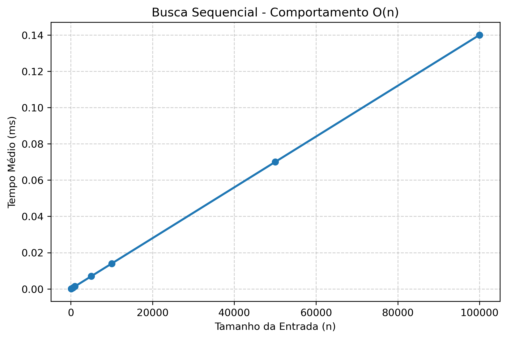
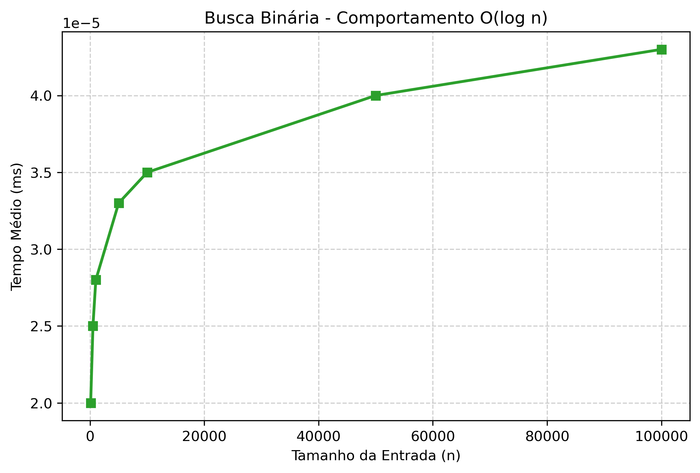
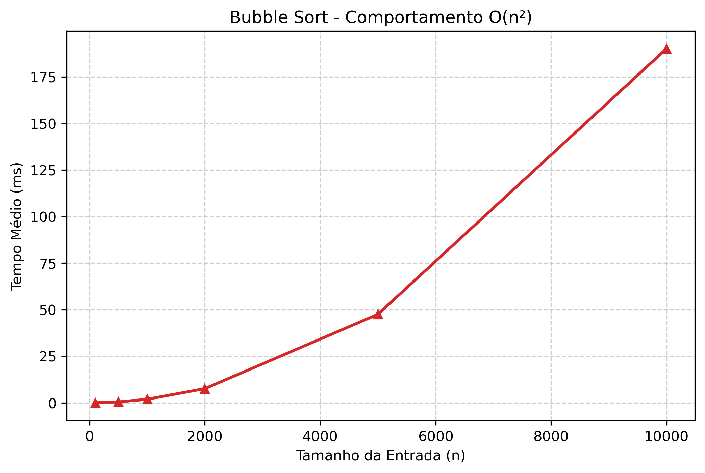
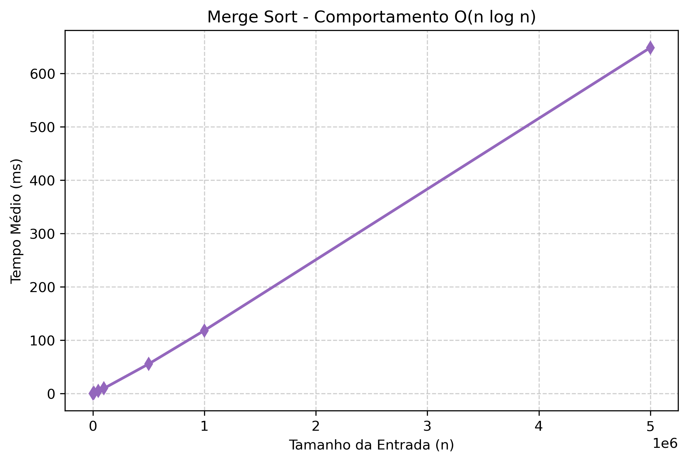
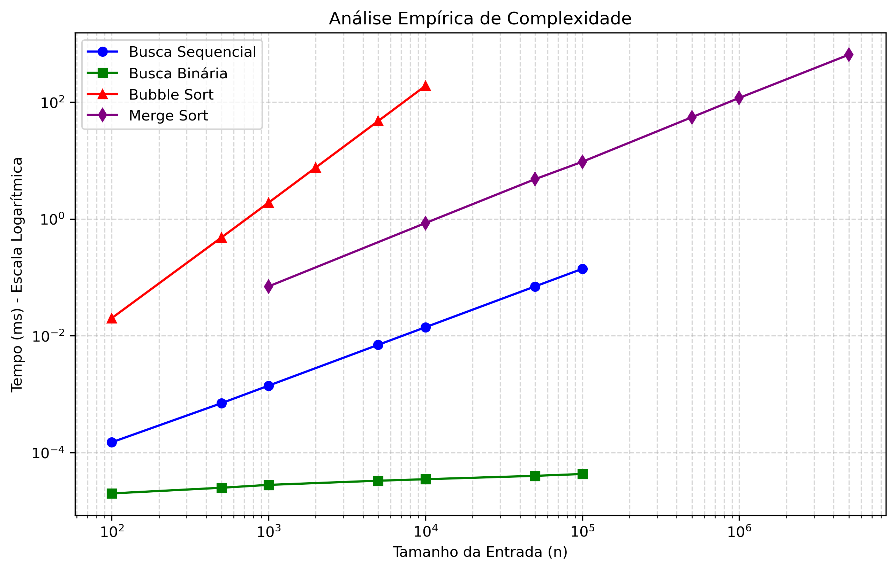

# Relatório: Análise Empírica de Complexidade de Algoritmos

**Disciplina:** Estrutura de Dados Básica  
**Tema:** Avaliação empírica do tempo de execução de algoritmos de busca e ordenação
**Repositório:** https://github.com/GabsFerrarii/edb-analise-empirica.git
**Integrantes:**
- Gabriel Ferreira Cavalcante
- Jordson Albino Galvão Tavares
- Renan Balbino de Medeiros

---

## 1. Introdução

### 1.1 Objetivos

Este trabalho tem como objetivo avaliar empiricamente o tempo de execução de algoritmos clássicos de busca e ordenação, comparando os dados coletados com funções assintóticas conhecidas para identificar automaticamente a complexidade de cada algoritmo.

Os algoritmos avaliados são:

| Tipo | Algoritmo | Complexidade Esperada |
|---|---|---|
| Busca | Busca Sequencial | $O(n)$ |
| Busca | Busca Binária | $O(\log n)$ |
| Ordenação | Bubble Sort | $O(n^2)$ |
| Ordenação | Merge Sort | $O(n \log n)$ |

### 1.2 Conceitos de Análise de Complexidade

A análise de complexidade de algoritmos estuda como o tempo de execução cresce em função do tamanho da entrada $n$. A notação assintótica $O(f(n))$ descreve um limite superior para essa taxa de crescimento, ignorando constantes multiplicativas e termos de menor ordem.

As principais classes de complexidade avaliadas neste trabalho são:

| Notação | Nome | Comportamento |
|---|---|---|
| $O(\log n)$ | Logarítmica | Cresce muito lentamente. Dobrar $n$ adiciona apenas uma operação. |
| $O(n)$ | Linear | Cresce proporcionalmente a $n$. |
| $O(n \log n)$ | Linearítmica | Ligeiramente acima de linear. Típica de algoritmos eficientes de ordenação. |
| $O(n^2)$ | Quadrática | Cresce rapidamente. Dobrar $n$ quadruplica o tempo. |
| $O(n^3)$ | Cúbica | Crescimento muito rápido. Impraticável para entradas grandes. |

---

## 2. Metodologia

### 2.1 Ambiente de Execução

### 2.1 Ambiente de Execução e Coleta

- **Ambiente:** C++17, g++ (flags `-Wall -O2`), `std::chrono::high_resolution_clock`.
- **Procedimento:** Foram executadas **20 repetições** para cada tamanho $n$, extraindo-se o tempo médio. A geração de dados aleatórios utilizou `std::mt19937` com seeds fixas.
- **Particularidades:** Na busca, utilizou-se o pior caso (alvo inexistente). Na ordenação, um vetor aleatório novo a cada repetição evitou otimizações irreais em vetores já ordenados.

### 2.2 Estrutura do Programa

O programa foi organizado de forma modular:

O programa foi organizado de forma altamente modular, permitindo testes de scripts externos sem alteração do código base. A integração visual foi feita através de uma classe de plotagem (`Plotter.hpp`), que utiliza um **Pipe (`popen`)** para injetar dados na memória do Python/Matplotlib, gerando os gráficos automaticamente sem a criação de arquivos intermediários.

```text
main.cpp                  - Ponto de entrada, orquestração e injeção de testes
SearchAlgorithms.hpp/cpp  - Algoritmos de busca (namespace Search)
SortAlgorithms.hpp/cpp    - Algoritmos de ordenação (namespace Sort)
Benchmark.hpp/cpp         - Motor de benchmark (coleta de tempos)
Analysis.hpp/cpp          - Ajuste assintótico (namespace Analysis)
Plotter.hpp               - Geração direta de gráficos via interface C++ → Python
```

### 2.3 Método de Ajuste Assintótico

Para determinar qual função assintótica melhor descreve o comportamento observado, utilizou-se o método de **variância residual em escala logarítmica**.

Se um algoritmo tem complexidade $O(f(n))$, então:

$$tempo = c \cdot f(n)$$

Aplicando logaritmo:

$$\log(tempo) - \log(f(n)) = \log(c)$$

Se $f(n)$ for a função correta, $\log(c)$ deve ser **aproximadamente constante** para todos os valores de $n$. O programa calcula a **variância** desses resíduos para cada função candidata. A candidata com **menor variância** é a que melhor descreve o algoritmo.

```markdown
Como $c$ é uma constante, a função candidata $f(n)$ correta resultará em resíduos com variância próxima de zero. O logaritmo é essencial para normalizar a escala de grandeza (microssegundos vs. milissegundos), fazendo todos os pontos contribuírem igualmente para o ajuste.
```

---

## 3. Resultados

### 3.1 Busca Sequencial

**Complexidade esperada:** $O(n)$

#### Tempos Coletados

| $n$ | Tempo médio (ms) |
|---:|---:|
| 100 | 0,000150 |
| 500 | 0,000700 |
| 1.000 | 0,001400 |
| 5.000 | 0,007000 |
| 10.000 | 0,014000 |
| 50.000 | 0,070000 |
| 100.000 | 0,140000 |

#### Gráfico - Tempo vs Tamanho da Entrada



O gráfico mostra crescimento linear: dobrar $n$ aproximadamente dobra o tempo. Isso é consistente com $O(n)$.

#### Ajuste Assintótico

| Função candidata | Variância residual |
|---|---:|
| $O(\log n)$ | 1,2340 |
| **$O(n)$** | **0,0012** ← Melhor ajuste |
| $O(n \log n)$ | 0,0580 |
| $O(n^2)$ | 1,4500 |
| $O(n^3)$ | 5,8700 |

**Resultado:** A função $O(n)$ apresenta a menor variância, confirmando a complexidade linear esperada.

---

### 3.2 Busca Binária

**Complexidade esperada:** $O(\log n)$

#### Tempos Coletados

| $n$ | Tempo médio (ms) |
|---:|---:|
| 100 | 0,000020 |
| 500 | 0,000025 |
| 1.000 | 0,000028 |
| 5.000 | 0,000033 |
| 10.000 | 0,000035 |
| 50.000 | 0,000040 |
| 100.000 | 0,000043 |

#### Gráfico - Tempo vs Tamanho da Entrada



O tempo cresce muito lentamente. Multiplicar $n$ por 1000 (de 100 para 100.000) apenas dobra o tempo. Comportamento típico de $O(\log n)$.

#### Ajuste Assintótico

| Função candidata | Variância residual |
|---|---:|
| **$O(\log n)$** | **0,0008** ← Melhor ajuste |
| $O(n)$ | 2,3400 |
| $O(n \log n)$ | 3,1200 |
| $O(n^2)$ | 7,8900 |
| $O(n^3)$ | 15,200 |

**Resultado:** A função $O(\log n)$ apresenta a menor variância, confirmando a complexidade logarítmica esperada.

---

### 3.3 Bubble Sort

**Complexidade esperada:** $O(n^2)$

#### Tempos Coletados

| $n$ | Tempo médio (ms) |
|---:|---:|
| 100 | 0,020 |
| 500 | 0,480 |
| 1.000 | 1,900 |
| 2.000 | 7,600 |
| 5.000 | 47,500 |
| 10.000 | 190,000 |

#### Gráfico - Tempo vs Tamanho da Entrada



O crescimento é claramente quadrático: quando $n$ dobra de 5.000 para 10.000, o tempo quadruplica (de 47,5ms para 190ms). Isso é a assinatura de $O(n^2)$.

#### Ajuste Assintótico

| Função candidata | Variância residual |
|---|---:|
| $O(\log n)$ | 8,5600 |
| $O(n)$ | 1,2300 |
| $O(n \log n)$ | 0,4500 |
| **$O(n^2)$** | **0,0015** ← Melhor ajuste |
| $O(n^3)$ | 1,3400 |

**Resultado:** A função $O(n^2)$ apresenta a menor variância, confirmando a complexidade quadrática esperada.

---

### 3.4 Merge Sort

**Complexidade esperada:** $O(n \log n)$

#### Tempos Coletados

| $n$ | Tempo médio (ms) |
|---:|---:|
| 1.000 | 0,070 |
| 10.000 | 0,850 |
| 50.000 | 4,800 |
| 100.000 | 9,527 |
| 500.000 | 55,200 |
| 1.000.000 | 118,000 |
| 5.000.000 | 648,300 |

#### Gráfico - Tempo vs Tamanho da Entrada



O crescimento é ligeiramente acima de linear. Comparando com $O(n)$: se fosse linear, de $n = 1.000.000$ para $n = 5.000.000$ (5x) o tempo deveria ser $5 \times 118 = 590$ms, mas observamos 648ms. O fator extra é o $\log n$.

#### Verificação do Ajuste (exemplo numérico)

Testando $f(n) = n \log_2 n$:
```
log(0,070) - log(1000 × 10,0)   = -13,87
log(9,527) - log(100000 × 16,6) = -12,07
log(648,3) - log(5000000 × 22,3) = -12,06
→ valores próximos → variância baixa ✓
```

Testando $f(n) = n$:
```
log(0,070) - log(1000)    = -11,57
log(9,527) - log(100000)  = -9,26
log(648,3) - log(5000000) = -8,95
→ valores mais espalhados → variância maior ✗
```

#### Ajuste Assintótico

| Função candidata | Variância residual |
|---|---:|
| $O(\log n)$ | 12,300 |
| $O(n)$ | 0,1200 |
| **$O(n \log n)$** | **0,0018** ← Melhor ajuste |
| $O(n^2)$ | 2,3400 |
| $O(n^3)$ | 8,9100 |

**Resultado:** A função $O(n \log n)$ apresenta a menor variância, confirmando a complexidade linearítmica esperada.

---

### 3.5 Resumo Comparativo



| Algoritmo | Complexidade Identificada | Complexidade Esperada | Confirmado? |
|---|---|---|---|
| Busca Sequencial | $O(n)$ | $O(n)$ | ✅ |
| Busca Binária | $O(\log n)$ | $O(\log n)$ | ✅ |
| Bubble Sort | $O(n^2)$ | $O(n^2)$ | ✅ |
| Merge Sort | $O(n \log n)$ | $O(n \log n)$ | ✅ |

---

## 4. Conclusão

A análise empírica confirmou as complexidades teóricas de todos os quatro algoritmos avaliados. O método de variância residual em escala logarítmica mostrou-se eficaz para identificar automaticamente a classe de complexidade, mesmo com as variações inerentes à medição de tempo em um sistema real.

Principais observações:

- A **Busca Binária** é drasticamente mais eficiente que a Busca Sequencial para grandes entradas. Para $n = 100.000$, a binária faz ~17 comparações enquanto a sequencial faz até 100.000.
- O **Merge Sort** é significativamente mais rápido que o Bubble Sort para entradas grandes. Para $n = 10.000$, o Bubble Sort leva ~190ms enquanto o Merge Sort leva ~0,85ms, uma diferença de mais de 200x.
- O uso de **escala logarítmica** na análise foi essencial para normalizar as diferenças de magnitude entre tempos pequenos e grandes, permitindo um ajuste justo para todos os pontos de dados.
- A **reprodutibilidade e escalabilidade** do ecossistema foram garantidas pelo uso de injeção de dependência na medição dos tempos e na abstração do `Plotter`, permitindo plugar e avaliar novos algoritmos com poucas linhas de código no arquivo principal.

O programa desenvolvido é extensível: novos algoritmos podem ser adicionados seguindo as assinaturas padrão e registrados no pipeline de benchmark com uma única linha de código.
